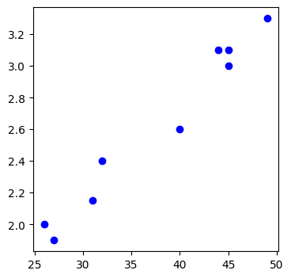
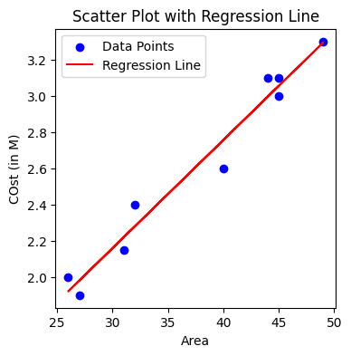
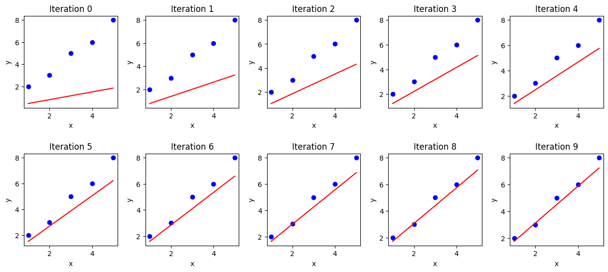

# Linear Regression
Linear regression is a statistical method used to model the relationship between a dependent variable and one or more independent variables by fitting a linear equation to the observed data. Let's say there are number of independent features(X) of a house like no of bedrooms, area of the land, location etc. and there is a dependent variable(y) say cost then linear regression is a technique that generates function such that we can predict value of dependent variable cost from values of independent variables. 


# Simple linear regression
If there is only one independent variable and one dependent variable we call it simple linear regression.


As we can see in the figure, we're given lots of known data, Now main goal of simple linear regression is to find a equation to the line that best fits the given data so that we can predict value of dependent variable with new values of independent features. 

<p>
So for a simple linear regression we basically want to get a function as 
$$f(X) = \hat{Y} = \beta_0 + \beta_1 . X $$

Here, \( \hat{Y} \) represents the predicted cost, \( \beta_0 \) is the intercept (where the line hits the Y-axis), \( \beta_1 \) is the slope of the line, and \( X \) is independent variable. And goal of the linear regression is to find values of  \( \beta_0 \) and \( \beta_1 \).
</p> 


# Multiple Linear Regression
Multiple linear regression extends the concept of simple linear regression by considering multiple independent variables that could influence the dependent variable. For example, in the context of predicting house prices, we might consider independent variables like the number of bedrooms, the area of the land, the location, and so on. The goal remains the same: to find a linear equation that best predicts the dependent variable (cost in this case) based on these independent variables.

<p>
The multiple linear regression equation can be represented as:
\[
\hat{Y} = \beta_0 + \beta_1 \cdot X_1 + \beta_2 \cdot X_2 + \ldots + \beta_n \cdot X_n
\]

Here, \( \hat{Y} \) is the predicted cost, \( \beta_0 \) is the intercept (the value of \( \hat{Y} \) when all independent variables are zero), \( \beta_1, \beta_2, \ldots, \beta_n \) are the coefficients that represent the effect of each independent variable \( X_1, X_2, \ldots, X_n \) on the predicted cost, respectively.
</p>

# Residuals and SSE
As we saw in the image above, line doesn't actually fit all data points and perfectly fitting all data points isn't also possible. So when we make predictions, there will be differences between the observed values (actual data points) and the predicted values (predicted by the model) and that is what we call Residuals.
Mathematically, the residual for an observation \( i \) is calculated as \( e_i = y_i - \hat{y}_i \), where \( y_i \) is the actual value and \( \hat{y}_i \) is the predicted value.
<br>
<p>
SSE stands for Sum of Squared Error, which is basically sum of square of all Residues.
$$ \text{SSE} = \sum_{i=1}^{n} (y_i - \hat{y}_i)^2 $$
</p>

Now for different values of predicted slope and intercept, we'll have different SSE, but when we plot the graph, we can see that it is always of a bawl shape as below.<br>


And our main aim is to find a equation to the line with smallest SSE. We'll study about 2 popular ways to find the equation **Ordinary least square** and **Gradient Descent**.

# Ordinary Least Square
<p>
Say we've multiple linear regression model \( \hat{Y} = \beta_0 + \beta_1 \cdot X_1 + \beta_2 \cdot X_2 + \ldots + \beta_n \cdot X_n \), we can represent this as \( \hat{Y} = X \cdot \hat{\beta} \) where \(X\) and \(\hat{\beta}\) are now matrices as
$$
X =  \begin{bmatrix} x_0 & x_1 &  x_2 & \ldots & x_n \end{bmatrix} 
$$
$$
\hat{\beta} =  \begin{bmatrix} \beta_0 \\ \beta_1 \\  \beta_2 \\ \vdots \\ \beta_n \end{bmatrix} 
$$
Then according to OLS, we can calculate value of \(\hat{\beta}\) such that SSE is minimum as
$$
 \hat{\beta} = (X^T X)^{-1} X^T y 
$$
</p>
Now I won't go through the whole derivation process of this formula as it might get quite complex, but you can check that out [here](https://math.stackexchange.com/questions/3278515/matrix-regression-proof-that-hat-beta-x-x-1-x-y-hat-beta-0-cho). In short we can derive this formula by using partial derivative of SSE with respect to column vector and equate to 0.
Although we can write code for OLS from scratch using given formula, we can easily implement it using [Linear Regression class from sklearn](https://scikit-learn.org/stable/modules/generated/sklearn.linear_model.LinearRegression.html) Library as follows:

```python
# Import required libraries
import pandas as pd
import matplotlib.pyplot as plt

# Create Datasets
data = pd.DataFrame(
    columns=['Area', 'Cost(in M)'],
    data=[[44, 3.1], [49, 3.3], [40, 2.6],
          [31, 2.15], [26, 2.0], [32, 2.4],
          [45, 3.0], [27, 1.9], [45, 3.1]
        ]
)

# Visualize dataset
plt.figure(figsize=(4, 4))
plt.scatter(x=data['Area'], y=data['Cost(in M)'], color='blue', label='Data Points')
plt.show()
```
**Plot:**



```python
# Import linear regression class
from sklearn.linear_model import LinearRegression

model = LinearRegression(fit_intercept=True) # If intercept isn't set true, it'll fit line with 0 intercept
model.fit(X=data[['Area']], y=data['Cost(in M)']) # Fit the model

# Let's predict outcomes by our model in given data itself and visualize the result
y_pred = model.predict(X=data[['Area']])

plt.figure(figsize=(4, 4))
plt.scatter(x=data['Area'], y=data['Cost(in M)'], color='blue', label='Data Points')
plt.plot(data['Area'], y_pred, color='red', label='Regression Line')
plt.xlabel('Area')
plt.ylabel('COst (in M)')
plt.title('Scatter Plot with Regression Line')
plt.legend()
plt.show()
```
**Plot:**



```python
# Some more useful methods of LinearRegression class

# Find intercept and coefficients
print('Intercept = ', model.intercept_)
print('Coefficients = ', model.coef_)

# Predict y for new X
print('Cost of house with area 56 = ', model.predict([[56]]))
```
```output
# Output
Intercept =  0.3678179824561414
Coefficients =  [0.05970395]
Cost of house with area 56 =  [3.71123904]
```

Now OLS looks pretty straightforward way to compute parameters which is true, but we can also tell it is computanialy very expensive because the more data we have dimensions of matrix X and y will get bigger, and multiplying and finding inverse of a such big matrix is very heavy task. So now let's discuss about iterative way of estimating parameters, Gradient Descent.


# Gradient Descent


```python
import numpy as np
import matplotlib.pyplot as plt

# Sample data (x and y)
x = np.array([1, 2, 3, 4, 5])
y = np.array([2, 3, 5, 6, 8])

# Parameters
learning_rate = 0.01
iterations = 10
m = 0  # Initial slope
b = 0  # Initial intercept

# Number of data points
n = len(x)

# Gradient Descent
cols = 5
rows = 2

fig, axs = plt.subplots(rows, cols, figsize=(15, 6))
fig.subplots_adjust(hspace=0.5, wspace=0.3)

for i in range(iterations):
    y_pred = m * x + b  # Predicted values
    D_m = (-2/n) * sum(x * (y - y_pred))  # Derivative with respect to m
    D_b = (-2/n) * sum(y - y_pred)        # Derivative with respect to b
    m = m - learning_rate * D_m           # Update m
    b = b - learning_rate * D_b           # Update b
    
    # Plot
    ax = axs[i // cols, i % cols]
    ax.scatter(x, y, color='blue')
    ax.plot(x, m * x + b, color='red')
    ax.set_title(f'Iteration {i}')
    ax.set_xlabel('x')
    ax.set_ylabel('y')

plt.show()

print(f"Slope (m): {m}")
print(f"Intercept (b): {b}")
```
**Plot:**


```output
# Output
Slope (m): 1.3724694948352136
Intercept (b): 0.3763067117982858
```


# Feature Scaling

# Goodness of fit

# Performance Metrics

# Overfitting and Underfitting

# Bias-Variance Tradeoff

# Regularization

# Ridge Regression

# Lasso Regression

# Classification

# Logistic Regression

# Sigmoid Function

# Decision Boundary

# Performance Metrics for Classification

# Projects
