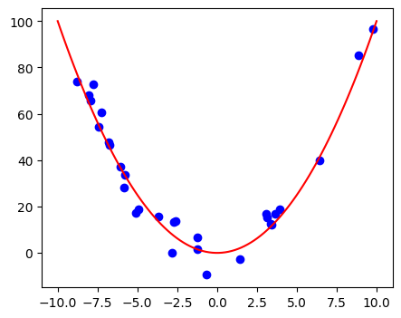
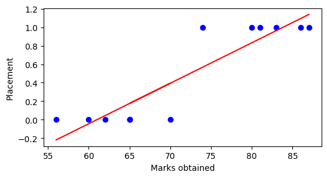
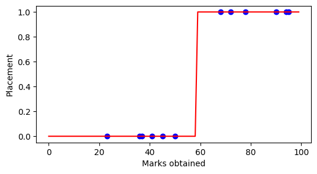

# Linear Regression
Linear regression is a statistical method used to model the relationship between a dependent variable and one or more independent variables by fitting a linear equation to the observed data. Let's say there are number of independent features(X) of a house like no of bedrooms, area of the land, location etc. and there is a dependent variable(y) say cost then linear regression is a technique that generates function such that we can predict value of dependent variable cost from values of independent variables. 


# Simple linear regression
If there is only one independent variable and one dependent variable we call it simple linear regression.


As we can see in the figure, we're given lots of known data, Now main goal of simple linear regression is to find a equation to the line that best fits the given data so that we can predict value of dependent variable with new values of independent features. 

<p>
So for a simple linear regression we basically want to get a function as 
$$f(X) = \hat{Y} = \beta_0 + \beta_1 . X $$

Here, \( \hat{Y} \) represents the predicted cost, \( \beta_0 \) is the intercept (where the line hits the Y-axis), \( \beta_1 \) is the slope of the line, and \( X \) is independent variable. And goal of the linear regression is to find values of  \( \beta_0 \) and \( \beta_1 \).
</p> 


# Multiple Linear Regression
Multiple linear regression extends the concept of simple linear regression by considering multiple independent variables that could influence the dependent variable. For example, in the context of predicting house prices, we might consider independent variables like the number of bedrooms, the area of the land, the location, and so on. The goal remains the same: to find a linear equation that best predicts the dependent variable (cost in this case) based on these independent variables.

<p>
The multiple linear regression equation can be represented as:
$$
\hat{Y} = \beta_0 + \beta_1 \cdot X_1 + \beta_2 \cdot X_2 + \ldots + \beta_n \cdot X_n
$$

Here, \( \hat{Y} \) is the predicted cost, \( \beta_0 \) is the intercept (the value of \( \hat{Y} \) when all independent variables are zero), \( \beta_1, \beta_2, \ldots, \beta_n \) are the coefficients that represent the effect of each independent variable \( X_1, X_2, \ldots, X_n \) on the predicted cost, respectively.
</p>

# Residuals, SSE and MSE
As we saw in the image above, line doesn't actually fit all data points and perfectly fitting all data points isn't also possible. So when we make predictions, there will be differences between the observed values (actual data points) and the predicted values (predicted by the model) and that is what we call Residuals.
Mathematically, the residual for an observation \( i \) is calculated as \( e_i = y_i - \hat{y}_i \), where \( y_i \) is the actual value and \( \hat{y}_i \) is the predicted value.
<br>
<p>
SSE stands for Sum of Squared Error, which is basically sum of square of all Residues.
$$ \text{SSE} = \sum_{i=1}^{n} (y_i - \hat{y}_i)^2 $$

And MSE Stands for Mean sum of squared error, which again is just mean of SSE.
$$ \text{MSE} =\frac{1}{n} \cdot \sum_{i=1}^{n} (y_i - \hat{y}_i)^2 $$

</p>

Now for different values of predicted slope and intercept, we'll have different SSE, but when we plot the graph, we can see that it is always of a bawl shape as below.<br>


And our main aim is to find a equation to the line with smallest SSE. We'll study about 2 popular ways to find the equation **Ordinary least square** and **Gradient Descent**.

# Ordinary Least Square
<p>
Say we've multiple linear regression model \( \hat{Y} = \beta_0 + \beta_1 \cdot X_1 + \beta_2 \cdot X_2 + \ldots + \beta_n \cdot X_n \), we can represent this as \( \hat{Y} = X \cdot \hat{\beta} \) where \(X\) and \(\hat{\beta}\) are now matrices as
$$
X =  \begin{bmatrix} x_0 & x_1 &  x_2 & \ldots & x_n \end{bmatrix} 
$$
$$
\hat{\beta} =  \begin{bmatrix} \beta_0 \\ \beta_1 \\  \beta_2 \\ \vdots \\ \beta_n \end{bmatrix} 
$$
Then according to OLS, we can calculate value of \(\hat{\beta}\) such that SSE is minimum as
$$
 \hat{\beta} = (X^T X)^{-1} X^T y 
$$
</p>
Now I won't go through the whole derivation process of this formula as it might get quite complex, but you can check that out [here](https://math.stackexchange.com/questions/3278515/matrix-regression-proof-that-hat-beta-x-x-1-x-y-hat-beta-0-cho). In short we can derive this formula by using partial derivative of SSE with respect to column vector and equate to 0.
Although we can write code for OLS from scratch using given formula, we can easily implement it using [Linear Regression class from sklearn](https://scikit-learn.org/stable/modules/generated/sklearn.linear_model.LinearRegression.html) Library as follows:

```python
# Import required libraries
import pandas as pd
import matplotlib.pyplot as plt

# Create Datasets
data = pd.DataFrame(
    columns=['Area', 'Cost(in M)'],
    data=[[44, 3.1], [49, 3.3], [40, 2.6],
          [31, 2.15], [26, 2.0], [32, 2.4],
          [45, 3.0], [27, 1.9], [45, 3.1]
        ]
)

# Visualize dataset
plt.figure(figsize=(4, 4))
plt.scatter(x=data['Area'], y=data['Cost(in M)'], color='blue', label='Data Points')
plt.show()
```
**Plot:**


```python
# Import linear regression class
from sklearn.linear_model import LinearRegression

model = LinearRegression(fit_intercept=True) # If intercept isn't set true, it'll fit line with 0 intercept
model.fit(X=data[['Area']], y=data['Cost(in M)']) # Fit the model

# Let's predict outcomes by our model in given data itself and visualize the result
y_pred = model.predict(X=data[['Area']])

plt.figure(figsize=(4, 4))
plt.scatter(x=data['Area'], y=data['Cost(in M)'], color='blue', label='Data Points')
plt.plot(data['Area'], y_pred, color='red', label='Regression Line')
plt.xlabel('Area')
plt.ylabel('COst (in M)')
plt.title('Scatter Plot with Regression Line')
plt.legend()
plt.show()
```
**Plot:**


```python
# Some more useful methods of LinearRegression class

# Find intercept and coefficients
print('Intercept = ', model.intercept_)
print('Coefficients = ', model.coef_)

# Predict y for new X
print('Cost of house with area 56 = ', model.predict([[56]]))
```
```output
# Output
Intercept =  0.3678179824561414
Coefficients =  [0.05970395]
Cost of house with area 56 =  [3.71123904]
```

# Gradient Descent

OLS looks pretty straightforward way to compute parameters which is true, but we can also tell it is computanialy very expensive because the more data we have dimensions of matrix X and y will get bigger, and multiplying and finding inverse of a such big matrix is very heavy task. Also when we have new data coming in regular basis, we can't simply improve model little by little, we have to compute again from scratch. To solve both of these issues, we can use iterative technique known as Gradient descent.

In general Gradient descent is an optimization algorithm used to minimize the cost function in any machine learning algorithms. The main idea behind gradient descent is to iteratively adjust the parameters of the model to find the values that minimize the cost function. Here in case of regression cost function measures the difference between the predicted values and the actual values i.e. MSE.
<br><br>
This is how gradient descent works:
1. Start with initial guesses for the model parameters (weights and biases).
2. Use the current parameters to make predictions for all training examples.
3. Measure the difference between the predicted values and the actual values to determine how well the model is performing. This is often done using a cost function like Mean Squared Error (MSE).
4. Calculate the gradient of the cost function with respect to each parameter. The gradient is the vector of partial derivatives of the cost function.
5. Adjust the parameters in the direction that reduces the error. The size of the adjustment is controlled by a learning rate.
6. Repeat steps 2-5 for a set number of iterations or until the error is sufficiently minimized or the changes to the parameters become very small.
<br><br>
Now let's try to implement it in code

```python
import numpy as np
import matplotlib.pyplot as plt

# Sample data (x and y)
x = np.array([1, 2, 3, 4, 5])
y = np.array([2, 3, 5, 6, 8])

# Parameters
learning_rate = 0.01
iterations = 10
m = 0  # Initial slope
c = 0  # Initial intercept

# Number of data points
n = len(x)

# Gradient Descent
cols = 5
rows = 2

fig, axs = plt.subplots(rows, cols, figsize=(15, 6))
fig.subplots_adjust(hspace=0.5, wspace=0.3)

for i in range(iterations):
    y_pred = m * x + c  # Predicted values
    D_m = (-2/n) * sum(x * (y - y_pred))  # Derivative with respect to m
    D_c = (-2/n) * sum(y - y_pred)        # Derivative with respect to c
    m = m - learning_rate * D_m           # Update m
    c = c - learning_rate * D_c           # Update c
    
    # Plot
    ax = axs[i // cols, i % cols]
    ax.scatter(x, y, color='blue')
    ax.plot(x, m * x + c, color='red')
    ax.set_title(f'Iteration {i}')
    ax.set_xlabel('x')
    ax.set_ylabel('y')

plt.show()

print(f"Slope (m): {m}")
print(f"Intercept (c): {c}")
```
**Plot:**


```output
# Output
Slope (m): 1.3724694948352136
Intercept (b): 0.3763067117982858
```

As we can see model is improving with each iterations. Gradient descent is one of the most important algorithm not only in Regression but in whole machine learning. So if you still don't understand it, try looking at some youtube videos. One of the best video is [Gradient Descent, Step-by-Step by statQuest.](https://youtu.be/sDv4f4s2SB8?si=wgrGddSy6V7vq4oA)

# Learning Rate 
In gradient descent, the learning rate is a hyperparameter that determines the size of the steps taken towards the minimum of the loss function during the optimization process. Essentially, it controls how quickly or slowly the model learns. Small learning rate gives more precise convergence to the minimum of the loss function, as the steps are smaller and more controlled but The training process becomes very slow and can get stuck in local minima, making it inefficient. Large learning rate Speeds up the training process but Can overshoot the minimum, leading to instability and divergence of the loss function, which means the model may not learn properly. So it's our job to find optimal learning rate.<br>


# Feature Scaling
Let's say we've 2 features, age and salary. Age is in the range of 1 to 100, while salary is above 10,000 and can have values like 100,000 or more. Having features of such different scales can affect our model. So it is desirable to avoid such cases and for that we use feature scaling. 
Feature scaling is a technique used to standardize the range of features of data in machine learning. Feature scaling ensures that each feature contributes proportionately to the result, preventing some features from dominating others simply due to their scale. Scaling features improves convergence rate in algorithms like gradient descent, prevents biased learning towards larger scale features and maintain Consistency in Distance-Based Algorithms. 2 popular Methods of Feature Scaling are Normalization and Standardization.

## 1. Min-Max Scaling / Normalization:
<p>
Min-Max scaling is a scaling technique where we scale data into certain range with fixed minimum and maximum value. We typically normalize data between 0 and 1. Formula and code for Normalization are : 
$$ 
X_{\text{scaled}} = \frac{X - X_{\text{min}}}{X_{\text{max}} - X_{\text{min}}} 
$$
</p>

```python
from sklearn.preprocessing import MinMaxScaler
scaler = MinMaxScaler()
scaled_data = scaler.fit_transform(data)
```
## 2. Standardization
<p>
Standardization Scales the data to have a mean of 0 and a standard deviation of 1. If data is normally distributed or or when using algorithms that assume normality we use Standardization. Formula and code for Standardization are : 
$$ X_{\text{scaled}} = \frac{X - \mu}{\sigma} $$
</p>

```python
from sklearn.preprocessing import StandardScaler
scaler = StandardScaler()
scaled_data = scaler.fit_transform(data)
```

# Performance Metrics
A performance metric is a quantitative measure used to evaluate the accuracy and effectiveness of our model. Performance metrics help in assessing how well the model's predictions match the actual data. They provide insights into various aspects of model performance, including the magnitude of prediction errors, the overall fit of the model, and its ability to generalize to new data. In general we divide our data into train and test set, train our model on train set and then evaluate it in test data using performance metrics. 
We can split our data in training and test set using [train\_test\_split](https://scikit-learn.org/stable/modules/generated/sklearn.model_selection.train_test_split.html) function from sklearn library.

```python
X_train, X_test, y_train, y_test = train_test_split(X, y, test_size=0.2, random_state=42)
# Test_size = 0.2 mean well get 20% data for test set and remaining 80% in train set. 
# And it's good practice to include some random state for reproducing same train and test sets.
```

Some popular performance metrics for linear regression are : 

## 1. Mean Absolute Error (MAE):
<p>
It is The average of the absolute differences between the predicted values and the actual values. Lower MAE indicates a better fit of the model.
<br> 
Formula : MAE = $ \frac{1}{n} \sum_{i=1}^{n} |y_i - \hat{y_i}| $ 
</p>

## 2. Mean Squared Error (MSE):
<p>
It is the average of the squared differences between the predicted values and the actual values. Lower MSE indicates a better fit of the model. It gives more weight to larger errors compared to MAE. <br>
Formula : MSE = $ \frac{1}{n} \sum_{i=1}^{n} (y_i - \hat{y_i})^2 $ 
</p>

## 3. Root Mean Squared Error (RMSE):
RMSE is simply under root of MSE.
<br><br>
RSS can also be used as performance metric, but we can see that main issue with all of these metric is their range is between 0 to infinity. So we can't really tell model is good enough or not by just looking at the metric value, we also needs to consider range and values on the data. For example if our data is salary and our MSE is 100, that means model is good. But 100 MSE in age is really bad, so we need some metric that solves this issue.

## 4. R-Squared:
<p>
It gives the proportion of the variance in the dependent variable that is predictable from the independent variables. It provides an indication of the goodness of fit of the model. R-Squared value always lies between 0 and 1, so unlike other matrices we can pre define performance criteria for our model without diving much into data itself. <br>
Formula: 
$ R^2 = 1 - \frac{SS_{\text{res}}}{SS_{\text{tot}}} $
</p>
<br>
For code we can use [sklearn.metrics](https://scikit-learn.org/stable/modules/model_evaluation.html#regression-metrics) module to import functions that returns required metric value from the data.

```python
from sklearn.metrics import mean_absolute_error, mean_squared_error, r2_score
import numpy as np

y_true = [5, 10, 15, 20, 25, 30] # Actual values
y_pred = [6, 9, 13, 22, 23, 28] # Predicted by model

# Calculate MAE
mae = mean_absolute_error(y_true, y_pred)

# Calculate MSE
mse = mean_squared_error(y_true, y_pred)

# Calculate RMSE
rmse = np.sqrt(mse)

# Calculate R-squared
r_squared = r2_score(y_true, y_pred)

print("Mean Absolute Error (MAE):", mae)
print("Mean Squared Error (MSE):", mse)
print("Root Mean Squared Error (RMSE):", rmse)
print("R-squared:", r_squared)
```

# Goodness of fit
<p>
So far we've only fitted straight line on our model, but can  we always fit straight line ? Well no, if scatter plot of given data looks like the image below, won't it be better to fit equations like $ y = \beta_0 + \beta_1 x + \beta_2 x^2 $ ?
</p>


So some times we might need to simply fit more complex curve if we're not getting good performance from our model. But it doesn't always solves the issue. If we fit equation of power *'n-1'* in data with *'n'* values, it has capacity to perfectly fit all the data points with SSE 0, but it's not only computationally impossible to do for large datasets, it gives one of the most popular Machine learning problem known as Overfitting.

# Overfitting and Underfitting
Overfitting is a common problem in machine learning where a model learns the training data too well, capturing not only the underlying patterns but also the noise and outliers. This results in a model that performs exceptionally well on the training data but poorly on new, unseen data.
Underfitting is simply model not being able to capture any pattern at all, neither in training data nor in newer one.


Fitting unnecessarily complex models, training to much in insufficient training data and noise are main causes of overfitting. We can solve this problem by using more simpler models that can generalize patterns, collating more data and removing noise and outliers. Underfitting is caused by using too simple model or not training the model well enough. And to solve underfitting we can use opposite approach of overfitting. <br>
To know whether model is overfitted or underfitted, we can look into it's bias and variance. High variance mean overfitted model and High bias means underfitted one.

# Bias-Variance Tradeoff
Bias refers to the error introduced by approximating a real-world problem, which may be complex, by a simplified model. High bias means that the model is too simple and does not capture the underlying patterns in the data, leading to systematic errors.<br>
Variance refers to the error introduced by the model's sensitivity to small fluctuations in the training data. High variance indicates that the model is too complex and is capturing noise and random fluctuations in the training data, rather than the true underlying patterns.<br>
The bias-variance tradeoff is a fundamental concept in machine learning that describes the tradeoff between bias and variance. Ideally, we want a model that captures the true patterns in the data (low bias) and generalizes well to new data (low variance). However, reducing bias typically increases variance and vice versa.


To find a balance between bias and variance, several techniques can be used:
1. Adjusting Model Complexity
2. Using Regularization
3. Using Cross validation
4. Using Ensemble Methods

# Regularization
Regularization is a technique used in machine learning to prevent overfitting by adding a penalty to the model's complexity. It discourages the model from fitting the training data too closely, thus promoting better generalization to unseen data. Regularization reduce overfitting, improve generalization and simplify models. Two popular regularization techniques are L1(Lasso) and L2(Ridge) regression.

# Lasso Regularization:
<p>
L1 regularization adds a penalty to the sum of the absolute values of the model's coefficients. Think of it as encouraging the model to be as simple as possible by shrinking some coefficients to zero. This makes the model ignore some features, effectively performing feature selection. 

$$ J(\theta) = \text{Loss}(\theta) + \lambda \sum_{j=1}^{n} |\theta_j| $$

Here $J(\theta)$ is total loss we're trying to minimize, $ \text{Loss}(\theta)$ is the original loss function without regularization (e.g., Mean Squared Error) and $\lambda$ is  the regularization parameter that controls the amount of regularization. Higher values of $\lambda$ increase the regularization effect, leading to simpler models. Finding the right regularization parameter typically involves using cross-validation to balance bias and variance.<br>
</p>
We can build a linear regression model with Lasso regularization using class [Lasso](https://scikit-learn.org/stable/modules/generated/sklearn.linear_model.Lasso.html) from sklearn.linear_model as follows

```python

from sklearn.linear_model import Lasso

# Define the model with L1 regularization
lasso = Lasso(alpha=0.1)

# Train the model on your data
lasso.fit(X_train, y_train)

# The model will have some coefficients exactly zero
print(lasso.coef_)
```

# Ridge Regularization:
<p>
L2 regularization adds a penalty to the sum of the squared values of the model's coefficients. This doesn't shrink coefficients to zero but makes them smaller overall. It spreads the importance more evenly among the features, preventing any one feature from having too much influence.

$$ J(\theta) = \text{Loss}(\theta) + \lambda \sum_{j=1}^{n} \theta_j^2 $$
</p>
Similarly we can use class [Ridge](https://scikit-learn.org/stable/modules/generated/sklearn.linear_model.Ridge.html) as follows to build linear model with Ridge Regularization. 

```python
from sklearn.linear_model import Ridge

# Define the model with L2 regularization
ridge = Ridge(alpha=1.0)

# Train the model on your data
ridge.fit(X_train, y_train)

# The model will have smaller coefficients, but none will be exactly zero
print(ridge.coef_)

```

# Classification
Classification is a type of supervised learning where the goal is to predict the categorical class labels instead of continuous values like regression. For example based on marks we need to say whether placement on specific company possible not not, answer is either *yes* or *no* there is no in between. Can we solve this using simple linear regression ?



Well we got our answer, NOT REALLY. So for classification we use other techniques like Logistic Regression, Decision Boundary, Decision trees etc.

# Logistic Regression
<p>
Logistic regression is a linear model used for binary classification problems. It predicts the probability that a given input belongs to a particular class. The output is a probability value between 0 and 1. Similar to linear regression, logistic regression starts by computing a linear combination of the input features as
$$Z = \beta_0 + \beta_1 x_1 + \beta_2 x_2$$
Then it passes result $Z$ into the sigmoid function to get probability value between 0 and 1.
$$ \sigma(z) = \frac{1}{1 + e^{-z}} $$
</p> 

The graph of sigmoid function looks like this :


<p>

The resulting probability is used to classify the input. Typically, if the probability is ≥ 0.5, the class label is 1; otherwise, it is 0.
$$ \hat{y} = 
    \begin{cases} 
    1 & \text{if } \sigma(z) \geq 0.5 \\
    0 & \text{if } \sigma(z) < 0.5 
    \end{cases}
$$
</p> 

Now we can use [LinearRegression](https://scikit-learn.org/stable/modules/generated/sklearn.linear_model.LinearRegression.html) class to get $Z$ and manually pass result through sigmoid and conditional statement. But more easily there is [LogisticRegression](https://scikit-learn.org/stable/modules/generated/sklearn.linear_model.LogisticRegression.html) class as well in same module, so let's use it:

```python
# Import required libraries
import numpy as np
import pandas as pd
import matplotlib.pyplot as plt

# Create data
data = pd.DataFrame(columns = ['Marks', 'Placement'], 
                    data = [[23, 0], [72, 1], [95, 1], [45, 0], 
                            [50, 0], [37, 0], [68, 1], [78, 1], 
                            [90, 1], [94, 1], [36, 0], [41, 0]])

data.head()

```
<div>
<style scoped>
    .dataframe tbody tr th:only-of-type {
        vertical-align: middle;
    }

    .dataframe tbody tr th {
        vertical-align: top;
    }

    .dataframe thead th {
        text-align: right;
    }
</style>
<table border="1" class="dataframe">
  <thead>
    <tr style="text-align: right;">
      <th></th>
      <th>Marks</th>
      <th>Placement</th>
    </tr>
  </thead>
  <tbody>
    <tr>
      <th>0</th>
      <td>23</td>
      <td>0</td>
    </tr>
    <tr>
      <th>1</th>
      <td>72</td>
      <td>1</td>
    </tr>
    <tr>
      <th>2</th>
      <td>95</td>
      <td>1</td>
    </tr>
    <tr>
      <th>3</th>
      <td>45</td>
      <td>0</td>
    </tr>
    <tr>
      <th>4</th>
      <td>50</td>
      <td>0</td>
    </tr>
  </tbody>
</table>
</div>

```python
# Import LogisticRegression class
from sklearn.linear_model import LogisticRegression

# Define the model
model = LogisticRegression(fit_intercept = True)

# Train the model on our data
model.fit(X = data[['Marks']], y=data['Placement'])

# Let's use trained model to predict for placement for marks between 0 - 100
X = np.array(range(100)).reshape(-1, 1)
y = reg.predict(X)

# Create Plot to see result
plt.figure(figsize=(6, 3))

plt.scatter(data['Marks'], data['Placement'], color='blue') # Original data
plt.plot(X, y, color='red') # Predicted data
plt.xlabel("Marks obtained")
plt.ylabel("Placement")
plt.show()
```



# Performance Metrics for Classification
Similar to regression, there are some metrics that can be used to test performance of our classification model.They are :

## 1. Accuracy
<p>
It is simply The fraction of predictions that the classifier predicted correctly.
$$ \text{Accuracy} = \frac{\text{No. of correct predictions}}{\text{No. of total predictions}} $$

But accuracy isn't really a good metric, specially in cases of imbalanced dataset. Say we've to predict whether patient has diabetes or not but only 10% people in test set has  diabetes. A model always predicts false for diabetes  gives accuracy of 90%, which is very high accuracy, but we know model isn't any good. So it's mostly better to consider other metrics.
</p>

## 2. Confusion matrix
So rather then looking at plain accuracy score we can use confusion matrix, that includes 4 values:
- **True positive** : Values that are positive and model also predicts positive.
- **True negative** : Values that are negative and model also predicts negative.
- **False positive** : Values that are negative but model predicts positive.
- **False negative** : Values that are positive but model predicts negative.


## 3. Precision and Recall
<p>
Precision is the ratio of correctly predicted positive observations to the total predicted positives. It answers the question: "Of all the instances that were predicted as positive, how many were actually positive?".
$$ \text{Precision} = \frac{\text{True Positive (TP)}}{\text{True Positive (TP)} + \text{False Positive (FP)}} $$

Recall is the ratio of correctly predicted positive observations to all observations in the actual class. It answers the question: "Of all the instances that actually were positive, how many were correctly predicted as positive?"
$$ \text{Recall} = \frac{\text{True Positives (TP)}}{\text{True Positives (TP)} + \text{False Negatives (FN)}} $$
</p>

But there is a precision-recall tradeoff due to inverse relationship between them. Improving one often results in a decrease in the other. Adjusting the decision threshold of a classifier can help manage this tradeoff, prioritizing either precision or recall based on the application's needs. For e.g. In an email spam detection system, we want to ensure that legitimate emails are not incorrectly marked as spam, so high precision is crucial to minimize the number of false positives. But in diagnosing a life-threatening disease, we want to identify as many true cases of the disease as possible, so in this case High recall is essential.

## 4. F1 Score
<p>
F1 score is the harmonic mean of precision and recall, providing a balance between the two. It's preferable to use F1 score when we want overall better model rather then going towards high precision or high recall. 
$$ \text{F1 Score} = 2 \times \frac{Precision \times Recall}{Precision + Recall} $$
</p>
Inside (Sklearn.Metrics)[https://scikit-learn.org/stable/modules/model_evaluation.html#classification-metrics] We can get all the required functions to calculate accuracy, confusion matrix, precision, recall and f1 score.

```python
from sklearn.metrics import accuracy_score, precision_score, recall_score, f1_score, confusion_matrix

# Let these be the true labels and the predicted labels
y_true = [0, 1, 0, 1, 0, 1, 1, 0, 1, 0, 1, 0, 1, 1] 
y_pred = [0, 1, 0, 1, 0, 1, 1, 0, 1, 1, 1, 1, 1, 0] 

# Calculate Accuracy
accuracy = accuracy_score(y_true, y_pred)

# Calculate Precision
precision = precision_score(y_true, y_pred)

# Calculate Recall
recall = recall_score(y_true, y_pred)

# Calculate F1 Score
f1 = f1_score(y_true, y_pred)

# Calculate Confusion Matrix
conf_matrix = confusion_matrix(y_true, y_pred)

print(f"Accuracy: {accuracy:.2f}")
print(f"Precision: {precision:.2f}")
print(f"Recall: {recall:.2f}")
print(f"F1 Score: {f1:.2f}")
print("Confusion Matrix:")
print(conf_matrix)

```
```output
# Output
Accuracy: 0.79
Precision: 0.78
Recall: 0.88
F1 Score: 0.82
Confusion Matrix:
[[4 2]
 [1 7]]

```


# Projects
## Coming soon...

