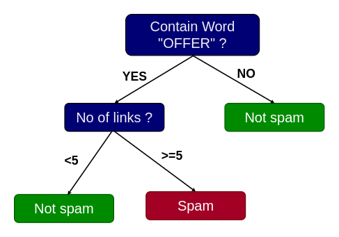
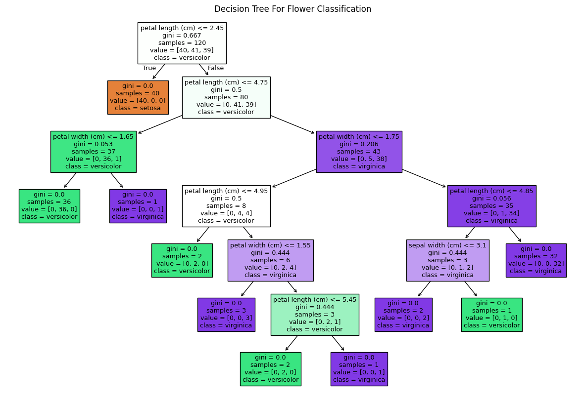
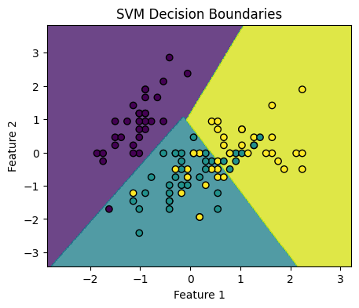

# Decision Tree
A Decision Tree is a supervised machine learning algorithm used for both classification and regression tasks. It is a non-parametric model that makes decisions based on the features of the input data.
Let's understand it with simple classification example.



As shown in the figure, It's a very simple spam classifier decision tree. To classify any mail, we'll first look if it contain word "OFFER", if no model conclude that as "NOT SPAM". Otherwise we'll look another feature "No of links", if it's more then 5 model classify mail as "SPAM" else it'll classify as "NOT SPAM".
<br>
So basically we split internal nodes into 2 or more child nodes based on certain feature's criteria, and when we reach the leaf node we'll have your output. Now with the data we have we need our model to learn which features to look initially and which features later on as well as the criteria of splitting. A model learns to make a decision tree through a process called recursive partitioning, which we'll discuss after Impurity metrics.

# Impurity Metrics
Impurity metrics are used in decision tree algorithms to measure the homogeneity of the labels at a node. If one node contains all data of only class 'A' then that node is fully pure, while having lat's say data of class 'A' and 'B' in ratio of 50-50 is highly impure. The goal of a decision tree is to create nodes that are as pure as possible, i.e. we'll try to split any node such that impurity in it's child class is as low as possible.
Some of the most commonly used impurity Metrics are as follows:

## 1. Gini Impurity:
Gini impurity measures the likelihood of a random sample being incorrectly classified based on the distribution of class labels in a node. For e.g. let's assume node as a bucket and data sample as red and blue balls. If bucket is mostly filled with red balls and a few blue balls, the Gini impurity would be low because if we randomly pick a ball, it's likely to be red. But if the bucket has an equal number of red and blue balls, the Gini impurity would be higher because picking a ball randomly could result in either color. 
We can calculate Gini impurity with formula:

<p>
$$
 Gini(p) = 1 - \sum_{i=1}^{K} (p_i)^2 
$$
where $p_i$ is the proportion of samples that belong to class $ i $ in node $p$.
</p>

## 2. Entropy:
Entropy is a measure of the impurity or uncertainty in a dataset. It quantifies how much information is needed to describe the randomness or disorder of a set of data points with respect to their class labels. A low entropy indicates a more ordered or homogeneous set, while a high entropy signifies greater disorder or diversity. ALthough It's slightly more computationally expensive due to logarithmic calculations, it's more sensitive nature to changes in the class probabilities, often leads to more balanced trees.
<p>
The entropy $ H(S) $ of a set $ S $ with $ K $ different classes is calculated as:
   
   $$ H(S) = - \sum_{i=1}^{K} p_i   \log_2(p_i) $$
   
   where $ p_i $ is the proportion of samples belonging to class $ i $ in the set $ S $.
</p>

## 3. Information Gain:
<p>
Information gain is a metric used in decision trees to measure the effectiveness of a feature in reducing uncertainty or entropy in the dataset. Formula for Information Gain is :
$$ Information Gain(G) = Entropy(L) - Entropy(L, A) $$
Where $ Entropy(L) $ is Entropy of parent node and $Entropy(L, A)$ is Entropy of child nodes after splitting parent node using attribute $A$.
</p>

# Recursive Partitioning
A model learns to make a decision tree through a process called recursive partitioning, which involves selecting feature splits that maximize the homogeneity (reduce impurity) of the target variable at each node. Here is step by step guide to make decision tree:
1. We start with evaluating all possible features and their potential splits in root node.
2. Find the split that separates the data according to the target variable, The criterion for the split is based on impurity metrics.
3. After the initial split, the process is repeated recursively for each child node.
4. The recursive splitting continues until no further improvement in impurity reduction is achieved by splitting further or any regularization method stops splitting. 

In code similar to Linear and Logistic Regression, we can use [DecisionTreeClassifier](https://scikit-learn.org/stable/modules/generated/sklearn.tree.DecisionTreeClassifier.html) from sklearn. Let's create a Decision tree for [iris flower dataset.](https://scikit-learn.org/stable/auto_examples/datasets/plot_iris_dataset.html)

```python
# Import necessary libraries
from sklearn.datasets import load_iris
from sklearn.model_selection import train_test_split
from sklearn.tree import DecisionTreeClassifier, plot_tree
import matplotlib.pyplot as plt

# Load the Iris dataset
iris = load_iris()
X = iris.data
y = iris.target

# Split the data into training and testing sets
X_train, X_test, y_train, y_test = train_test_split(X, y, test_size=0.2, random_state=42)

# Initialize the DecisionTreeClassifier
clf = DecisionTreeClassifier(random_state=42)

# Train the Decision Tree Classifier
clf.fit(X_train, y_train)

# Predictions on the test data
y_pred = clf.predict(X_test)

# Evaluate the model
accuracy = clf.score(X_test, y_test)
print(f"Accuracy: {accuracy}")

# Plot the decision tree (optional)
plt.figure(figsize=(15, 10))
plot_tree(clf, filled=True, feature_names=iris.feature_names, class_names=iris.target_names)
plt.title("Decision Tree For Flower Classification")
plt.show()
```
```output
#  Output
Accuracy: 1.0
```


# Overfitting In Decision Tree
Although in above case our model is 100% accurate, we can see that when we go deeper and deeper number of sample in nodes kept decreasing to the point few nodes are created just because 1 or 2 data items satisfies that condition. And when model become that much dependent in single data point, it causes Overfitting. When we directly create Decision tree it can go to the depth where no leaf nodes have impurities (i.e all items in one node are all of same class), but not that only causes overfitting it is computationally expensive if dataset is big. So we'll be using Regularization techniques to solve both of these issues.

# Regularization : Early Stopping
Early stopping is one of the Regularization technique where we stop decision tree from splitting before it reaches its maximum depth or complexity. Their are mainly 3 types of early stopping, and fulfilling any one of the criteria will stop tree from growing further:
1. **Maximum Depth:** Limiting the depth of the tree prevents it from becoming too complex and overfitting the training data. 
2. **Minimum Samples per Leaf:** Ensuring each leaf node contains a minimum number of samples helps to generalize better. Nodes with fewer samples might capture noise rather than true patterns.
3. **Minimum Impurity Decrease:** Only allow a split if it decreases the impurity by a certain threshold. This prevents splitting on features that don't significantly improve the model's performance.

In code we can give early stopping criteria as argument to [DecisionTreeClassifier](https://scikit-learn.org/stable/modules/generated/sklearn.tree.DecisionTreeClassifier.html) class.

```python
clf = DecisionTreeClassifier(max_depth=5, 
                              min_samples_leaf=10, 
                              min_impurity_decrease=0.01)

```

# Regularization : Pruning
Pruning is another regularization technique that involves the process of removing parts of the tree that do not provide significant predictive power to improve the model's performance on unseen data. Early stopping is also called pre pruning but we also have cost complexity pruning that involves growing the full tree and then removing nodes that do not provide sufficient improvement in model performance. It uses a cost-complexity measure to evaluate the importance of nodes and prunes those that do not meet a specified criterion.

## Cost complexity measure
<p>
It is a metric used to evaluate the complexity of a subtree in relation to its predictive performance. Specifically, it quantifies the trade-off between the complexity (number of nodes and splits) of a decision tree and its ability to accurately classify or predict outcomes on new data.
Mathematically: 
$$ Cost \space complexity = Error \space term + Complexity \space penalty $$
Where $Error \space term$ represent impurity of subtree (Gini impurity or entropy) and $Complexity \space Penalty$ refers to complexity of subtree, often measured by the number of nodes or splits.
</p>
In sklearn we can set `ccp_alpha` argument to perform pruning in [DecisionTreeClassifier](https://scikit-learn.org/stable/modules/generated/sklearn.tree.DecisionTreeClassifier.html).

```python
clf = DecisionTreeClassifier(ccp_alpha=0.01)

```


# Support Vector Machines (SVM)
SVM is another popular supervised learning method whose main idea is to find a hyperplane that best divides a dataset into classes.


So we basically try to find a line in 2d Space (Plane in case of 3d and so on) that puts data of same class in same side of the line and other in other side. However there are multiple lines that can do so right ? Well SVM also tries to maximize the margin which the distance between the hyperplane and the nearest data point from either class. <br>
However it might not be possible to always fit a straight line or linear plane as decision boundary, in such sceneries we need to introduce non linearity which we can do using Kernel. Kernel is a function that transforms data into a higher-dimensional space, SVM then finds a linear hyperplane in higher dimension. Which if transformed back in feature space might give something like curve or complex non linear boundary.

In code we can use [SVC](https://scikit-learn.org/stable/modules/generated/sklearn.svm.SVC.html#sklearn.svm.SVC) class from [sklearn.svm](https://scikit-learn.org/stable/api/sklearn.svm.html) Module to implement SVC as follows
```python
# Import necessary libraries
from sklearn.datasets import load_iris
from sklearn.model_selection import train_test_split
from sklearn.preprocessing import StandardScaler
from sklearn.svm import SVC
from sklearn.metrics import accuracy_score, confusion_matrix
import matplotlib.pyplot as plt
import numpy as np

# Load the Iris dataset
iris = load_iris()
X = iris.data[:, :2]  # Only take the first two features for simplicity
y = iris.target

# Split the dataset into training and testing sets
X_train, X_test, y_train, y_test = train_test_split(X, y, test_size=0.3, random_state=42)

# Standardize the features
scaler = StandardScaler()
X_train = scaler.fit_transform(X_train)
X_test = scaler.transform(X_test)

# Create an SVM classifier with a linear kernel
svm = SVC(kernel='linear', C=1.0, random_state=42)
svm.fit(X_train, y_train)

# Make predictions on the test set
y_pred = svm.predict(X_test)

# Evaluate the model
accuracy = accuracy_score(y_test, y_pred)
print(f'Accuracy: {accuracy:.2f}')
print('Confusion Matrix:')
print(confusion_matrix(y_test, y_pred))

# Plot decision boundaries
def plot_decision_boundaries(X, y, model):
    h = .02  # step size in the mesh
    x_min, x_max = X[:, 0].min() - 1, X[:, 0].max() + 1
    y_min, y_max = X[:, 1].min() - 1, X[:, 1].max() + 1
    xx, yy = np.meshgrid(np.arange(x_min, x_max, h), np.arange(y_min, y_max, h))
    Z = model.predict(np.c_[xx.ravel(), yy.ravel()])
    Z = Z.reshape(xx.shape)
    plt.contourf(xx, yy, Z, alpha=0.8)
    plt.scatter(X[:, 0], X[:, 1], c=y, edgecolors='k', marker='o')
    plt.xlabel('Feature 1')
    plt.ylabel('Feature 2')
    plt.title('SVM Decision Boundaries')
    plt.show()

# Plot the decision boundaries
plot_decision_boundaries(X_train, y_train, svm)
```
```output
# Output
Accuracy: 0.73
Confusion Matrix:
[[19  0  0]
 [ 0  7  6]
 [ 0  6  7]]
```


# K-Nearest Neighbors
K-Nearest Neighbors is one of the simplest ML algorithm, so much so some people don't even consider as Machine Learning. Because unlike other algorithm we've studies so far, we'll try to learn some parameters or criteria, but here we won't do so. It is a instance-based learning algorithm that's based on the principle that similar data points are close to each other.

.png)

Here we plot all the data points in a 2d plane or higher dimensional space, and when new data point arrives we'll put that into the plane and look for some K number of neighbors (Closest Data point), and assign class that maximum neighbors belong to. In the figure above we're looking for 3-Nearest Neighbors, among which 2 of them belongs to class 2, so we'll assign class 2 to the target variable.
We can create and train KNN model using [KNeighborsClassifier](https://scikit-learn.org/stable/modules/generated/sklearn.neighbors.KNeighborsClassifier.html) from [sklearn.neighbors.](https://scikit-learn.org/stable/api/sklearn.neighbors.html)
```python
# Create and train the KNN classifier
import numpy as np
from sklearn.neighbors import KNeighborsClassifier

# Example data: [height (cm), weight (kg)]
X = np.array([
    [170, 65], [165, 58], [180, 75], [175, 70], [160, 55],
    [185, 80], [155, 50], [190, 90], [170, 72], [168, 65]
])

# Labels: 0 = Female, 1 = Male
y = np.array([0, 0, 1, 1, 0, 1, 0, 1, 1, 0])

# Create and train the KNN classifier
k = 3
knn = KNeighborsClassifier(n_neighbors=k)
knn.fit(X, y)

# Example of predicting the class for a new data point
new_data = np.array([[172, 68]])
prediction = knn.predict(new_data)

print(f"Predicted class : {'Male' if prediction == 1 else 'Female'}")
```
```output
# Output
Predicted class : Male
```

# Distance Metrics
A distance metric is a measure of the distance between two points in a given space. It quantifies the similarity or dissimilarity between two data points and is fundamental to many machine learning algorithms like KNN or K-Means clustering etc. Some commonly used distance metrics are as follows:
## 1. Euclidean Distance:
<p>
It's the "ordinary" straight-line distance between two points in Euclidean space. Better to use when features are continuous and equally scaled.
$$ Euclidean \space Distance=  \sqrt{\sum_{i=1}^{n} (p_i - q_i)^2} $$
</p>

## 2. Manhattan Distance
<p>
It's the sum of the absolute differences of their Cartesian coordinates, it's also known as L1 distance, city block distance or taxicab distance. It's mostly used when the features are not continuous or you expect high dimensionality with many zero features.
$$ Manhattan \space Distance =  \sum_{i=1}^{n} |p_i - q_i| $$
</p>

## 3. Minkowski Distance
<p>
It's a generalized form of both Euclidean and Manhattan distances. When r=1, it is equivalent to Manhattan Distance and when r=2, it is equivalent to Euclidean Distance.
$$ Minkowski \space Distance = \left( \sum_{i=1}^{n} |p_i - q_i|^r \right)^{\frac{1}{r}} $$
</p>

## 4. Cosine Similarity
<p>
It measures the cosine of the angle between two vectors, often used in text analysis and information retrieval. In higher-dimensional spaces, cosine similarity is preferred over other distance measures like Euclidean or Manhattan distances because points are more likely to be far apart in terms of distance simply due to the increased number of dimensions, so it's better to look at the angle for similarity.

$$ Cosine \space Similarity = \frac{p \cdot q}{\|p\| \|q\|} $$

$$ Cosine \space Distance = 1 - Cosine \space Similarity $$

</p>

# Projects
## Coming soon...
